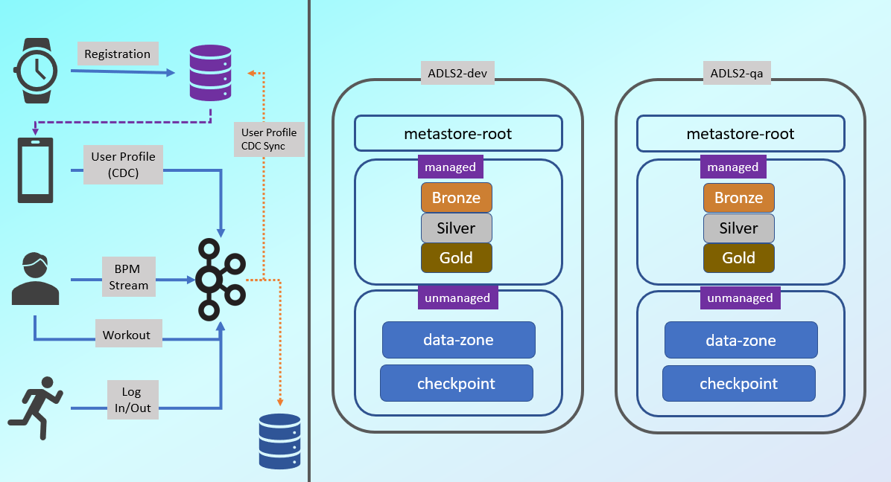
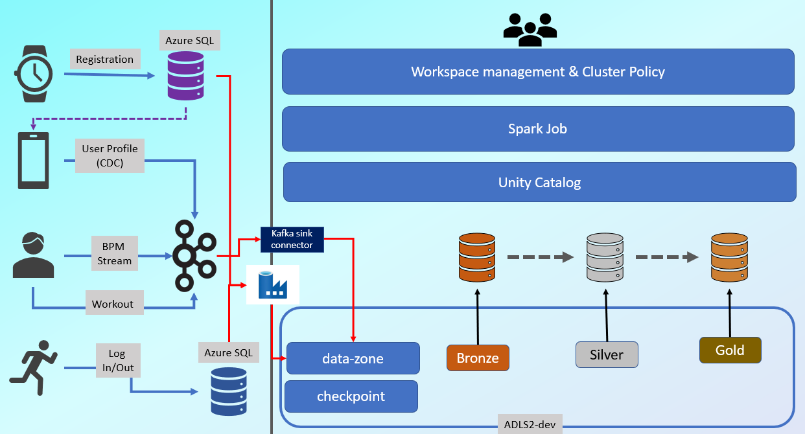
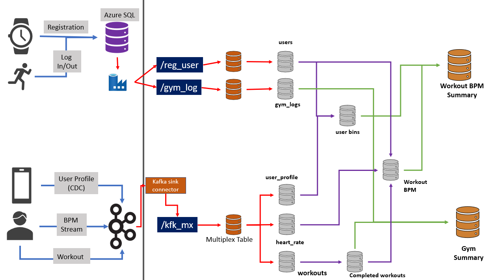

# KoreVital
# Smart Watch Use case
It is a wearable device manufacturing company.It manufactures a wristwatch kind of device.The end users can wear this device, which is used to continuously send health parameters to your company servers.

## Project details
A retailer sells the device to the customer and registers the device at the time of sale. The device registration is nothing but creating a user ID, device ID, and linking the device hardware address with the user. This data is stored in a database and this database sits in the cloud platform.
|UserID|DeviceID|MacAddress|RegistrationTimestamp|
|-|-|-|-|
|111|222|aw:ec:59:ca:f2|155871498|

Company also created a mobile app for the end users so a user can purchase the device, complete the device registration, and download the companion mobile app. 
The mobile app is used to create a user profile, provide health reports, and notify him with alerts. So the second data set is the user profile data. When a user creates his profile, we capture the profile information in a Kafka topic.However, the user can also update his profile information. So the second data set is a change data set.
Here are the three possibilities.

- So let's assume the user is creating his profile for the first time. The mobile app will create a new Json record similar to the one shown here, and send it to a Kafka topic.
```json
{
    "user_id": 19548,
    "update_type": "new",
    "timestamp": 1576438349.0,
    "dob": "02/12/1972",
    "sex": "F",
    "gender": "F",
    "first_name": "John",
    "last_name": "Doe",
    "address": {
      "street_address": "5641 Kelly Tunnel Apt. 584",
      "city": "Los Angeles",
      "state": "CA",
      "zip": 90026
    }
  }
```
- Later, when the user updates his profile, we will create an update record and send it again to the same Kafka topic.
```json
{
    "user_id": 36164,
    "update_type": "update",
    "timestamp": 1576264662.0,
    "dob": "10/08/1935",
    "sex": "F",
    "gender": "F",
    "first_name": "caitlin",
    "last_name": "Miles",
    "address": {
      "street_address": "176 Sandra Lane Suite 564",
      "city": "Carson",
      "state": "CA",
      "zip": 90746
    }
  }
```
- Similarly, when a user deletes his profile, we send a delete record to the same Kafka topic.
```json
{
    "user_id": 42643,
    "update_type": "delete",
    "timestamp": 1575853777.0
  }
```

The end user is wearing the device. The device keeps track of his pulse and sends a heart rate event to a Kafka topic.So the device continuously sends a stream of heart rate events to a Kafka topic. This one is the third data set. It is simple, but getting generated as a high volume data stream.
```json
{
    "device_id" : 111398,
    "time" : 1575158500,
    "heartraate" : 68.65
}
```

Company has a partnership with various healthcare and fitness centers, so the user can join one of the health or fitness centers.A  device identification scanner is  installed in these partner facilities.So when a user enters the facility, you can detect his device and create a login event. Similarly, you can also detect a log out event when a user leaves the facility. So the fourth data set is a login and log out event sent to a Kafka topic.
|MacAddress|GymId|LogIn|LogOut|
|-|-|-|-|
|aw:ec:59:ca:f2|5|1575158500|1575163000|

Your end user is entering the fitness center to do some workouts. Your device comes with a push button to record the start and stop of the workout session. A user will press the start workout button before starting the exercise. Once done exercising, he can press the stop button. That's how we know he is doing a workout and we capture the workout session. Start and stop events in a separate Kafka topic.
```json
{
    "user_id": 16093, 
    "workout_id": 26,
    "timestamp": 1575899016.0,
    "action": "start",
    "session_id": 502
}
```
```json
{
    "user_id": 31362,
    "workout_id": 36,
    "timestamp": 1575896518.0, 
    "action": "stop",
    "session_id": 300
}
```
## Final Requirements
- Workout BPM Summary
```bash
    root
    |-user_id
    |-date
    |-workout_id
    |-session_id
    |-age(GDPR PII)
    |-sex(GDPR PII)
    |-city(GDPR PII)
    |-state(GDPR PII)
    |-rec_no
    |-max_bpm
    |-min_bpm
    |-avg_bpm
```
- Gym Summary
```bash
    root
    |-gym_id
    |-mac_address(GDPR PII)
    |-date
    |-workouts
    |-Mins_in_gym
    |-Mins_in_exercising
```
1.  Design a secure lakehouse for dev, qa, uat & prod
2. decouple data ingestion from data processing
3. support batch and streaming workflows
4. automate ingestion testing
5. Automate deployment pipeline
6. Automatic Code coverage
7. Infra as code deployment in Azure Platform.
8. Loggig and Monitoring.
9. Cost Control.

## Architecture
### operational Req (In Orange) :
- user profile sync with kafka topic & registration db 
- Log in Log out in a separate Table  for Gym

**Storage Arch :**



**Overall Pipeline :**
- spark  can read from data zone
- spark can read write on checkpoint
- spark can read write on bronze/silver/gold tables but not on directories.


### Detailed Arch :

